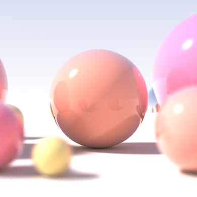
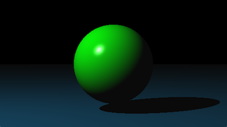
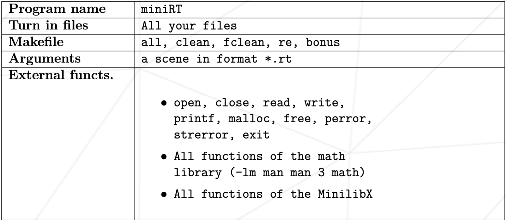

🔔 **Before you start** 🔔  
> This project is part of the [42 computer programming schools](https://www.42network.org/) common-core curriculum. 42 is a non-profit educational organization characterized by its peer-to-peer and project-based learning method. You'll find a [subject](en.subject.pdf) of the project in the repository.

---

# 🎨📒 miniRT

### Table of Contents

- [🛫 Intro ](#-intro)
- [✨ Characteristics](#-characteristics)
- [🛠️ Tools used](#️-tools-used)
- [🚀 Quick guide](#-quick-guide)
- [🎨 Bonus](#-bonus)
- [📖 Training report](#-training-report)
- [🏆 Acquired skills](#-acquired-skills)
- [🔧 Future improvement and/or next steps](#-future-improvement-andor-next-steps)
- [🤝 Acknowledgements](#-acknowledgements)
- [📚 References](#-references)
- [✅ To-do list](#-to-do-list)

## 🛫 Intro

[Ray tracing](https://en.wikipedia.org/wiki/Ray_tracing_(graphics)) is a technique to compute a description
of a scene to render a 3D-looking image. Using several principles of linear algebra and trigonometry,
this method recreates the lighting of that scene, making it look like a realistic(ish) object.

It gets its name from the concept of a ray, a tuple of a point in space and a vector, which represents the
origin of a light ray and its orientation. Creating the algorithms that compute the way that a light ray bounces
on objects and reaches the camera is the core of the idea, but depending on the preferences of the user
different parameters may be used to recreate even more characteristics for the perception of the image.

## ✨ Characteristics

- As for us, we have chosen to use the [Phong reflection model](https://en.wikipedia.org/wiki/Phong_reflection_model),
which lets the user change values like `diffuse`, `ambient`, `brightness`, `shininess` and `specular`.

- The code follows the [42 Norm](https://github.com/42School/norminette/blob/master/pdf/en.norm.pdf) standard
in accordance with the 42 evaluation criteria.

- This program has been tested on Linux and macOS.

## 🛠️ Tools used

The [MiniLibX](https://github.com/42-Fundacion-Telefonica/MLX42.git) is a tiny graphics library that allows you to do the most basic things for rendering something on screens without any knowledge of X-Window and Cocoa.

The headers used for the rest of the functions are:

| Header File  | Functions                  |
|--------------|----------------------------|
| `math.h`     | `sqrt`, `pow`, `tan`       |
| `stdlib.h`   | `free`, `malloc`, `exit`   |
| `unistd.h`   | `close`, `read`, `write`   |
| `stdio.h`    | `printf`, `perror`         |
| `fcntl.h`    | `open`                     |
| `string.h`   | `strerror`                 |

## 🚀 Quick guide

The first thing you must do is clone the repository, but remember to run it with the `--recursive-submodules` flag to download the MiniLibX content. Or run `git submodule update --init` after cloning.

When running make, any errors that might arise could probably be due to the lack of the libraries needed for the MiniLibX. I have never used CMake before and don't fully understand this tool yet, so I can't provide solutions regarding this builder.

Once you manage to get the executable, you can choose one scene from the `scenes` folder and run its path as the only parameter. Excluding memory errors, the program should open a window with the image.

## 🎨 Bonus

- The light has the additional parameter `color`.

## 📖 Training report

This project has been a real journey—I even had to restart it and rethink my approach halfway through. On the other hand, I ended up enjoying proving myself that I was capable of such a complex (for me at this moment) project.

## 🏆 Acquired skills

- Apart from the obvious **C**, I improved even more my skills in **make** and **git**.
- I expanded my knowledge of the use of a graphics library.
- I learned fairly complex mathematical operations, which really opened my mind.
- I improved my researching abilities during the crisis since we had to reach out for help to improve our documentation and get to understand the problems that kept bugging us.

## 🔧 Future improvement and/or next steps

### ✅ To-do list

- Poner todos los pixels a cero con ft_bzero antes de pasar la imagen
- Controlar los grados de apertura límites
- Arreglar que puedan faltar luz, cámara y ambient
- Controlar líneas vacías en el archivo
- Comparar bien los fpn con epsilon
- Argumento de los vectores de dirección revisar requisitos
- Arreglar las sombras dentro de los objetos
- For the time being, only `ambient` can be set from the executable arguments.

## 🤝 Acknowledgements

This is a shared project! Working with my partner [MarkelUribe](https://github.com/MarkelUribe) has been a truly enriching experience.

## 📚 References

| Type          | Title                                                                 | Link                                                                 |
|---------------|-----------------------------------------------------------------------|----------------------------------------------------------------------|
| YouTube Video | Linear algebra                                                       | [Watch here](https://www.youtube.com/watch?v=fNk_zzaMoSs&list=PLZHQObOWTQDPD3MizzM2xVFitgF8hE_ab) |
| YouTube Video | Tutorial                                                             | [Watch here](https://www.youtube.com/watch?v=RIgc5J_ZGu8&list=PLAqGIYgEAxrUO6ODA0pnLkM2UOijerFPv) |
| YouTube Video | Vectors                                                              | [Watch here](https://youtu.be/Ej3ZVxljJfo?si=9LpRtvTOOULlAH8K)       |
| Book          | Ray Tracing in One Weekend                                           | [Read here](https://raytracing.github.io/books/RayTracingInOneWeekend.html) |
| Book          | The Ray Tracing Challenge                                            | [Read here](http://raytracerchallenge.com/) |
| Web Page      | scratchpixel                                                         | [Visit here](https://raytracing.github.io/books/RayTracingInOneWeekend.html) |

---

### 🎉 Thanks!
Don't hesitate to contact me. You have the info in [my profile](https://github.com/palgarob)
